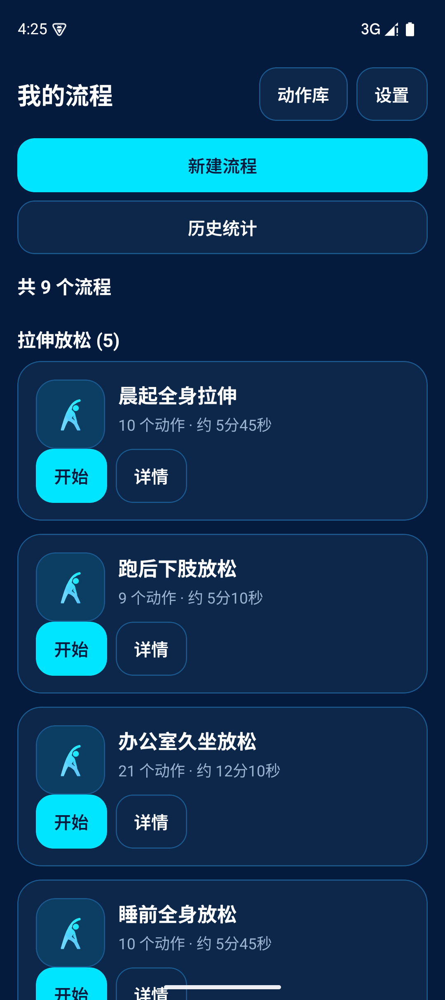
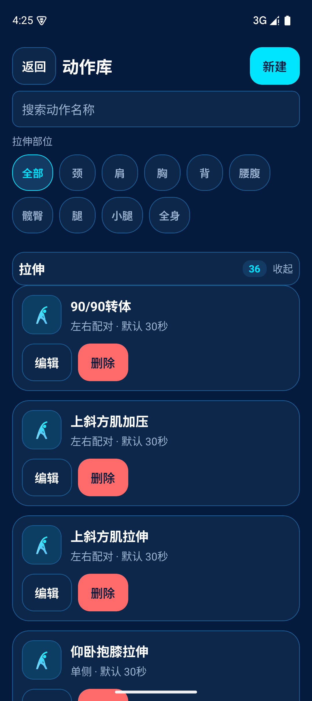
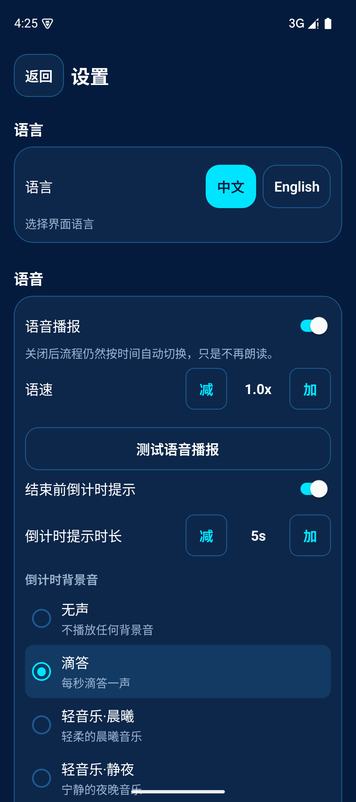

# 拉伸语音播报 App

做拉伸不用盯屏幕数秒：动作和节拍靠语音念给你听，跟着念完就练完。手机揣兜里、眼睛看着镜子也能做完整段。

简体中文 | [English](./README.en.md)

<p>
  
  
  
</p>

## 它能做什么

- **念着做**：每个动作到点播报（还有几秒、换边、下一个动作），不用看屏幕。
- **自带一套动作**：内置动作库，按部位筛选，直接拼成流程就能开始。
- **流程自己定**：新建流程挑动作、排顺序；也预置了晨起全身、跑后下肢、办公室久坐、睡前放松等常见流程。
- **能循环、能变速**：一段接一段跑完，节奏可快可慢。
- **有背景音**：语音播报之外可以叠一层背景音。
- **练过的有记录**：历史统计留着你做过哪些流程、多少次。

## 适合谁

每天要拉伸但嫌「一边看手机一边数秒」麻烦的人；跑步、健身后要放松的人；办公室久坐想偷偷做一组的人。

## 快速开始

需要 Node 与 Android 环境（真机或模拟器）。

```bash
npm install
npx expo start        # 开发调试
npm run android       # 构建并装到安卓设备
npm run test          # 跑测试
npm run typecheck     # 类型检查
```

数据存在手机本地，没有账号、不需要登录、不联网也能用。

## 现在到哪一步了

- 版本号 **1.2.0**（`app.json`）。
- 主要面向**安卓**；开发已阶段性收工，进度与挂账见 `docs/handoff/HANDOFF.md`。
- 已知待办：安卓前台服务、省电模式（Doze）与不同安卓版本的适配还没排期。

## 想看更多

- 技术栈：Expo 57 + React Native，语音用 `expo-speech`，背景音用 `expo-audio`，本地数据用 `expo-sqlite`。
- 开发计划与验收记录：`docs/plan/`、`docs/qa/`、`docs/handoff/`。
- 本项目附带的治理脚手架说明（与 App 功能无关）：`docs/ORCA-模板包原文.md`。
